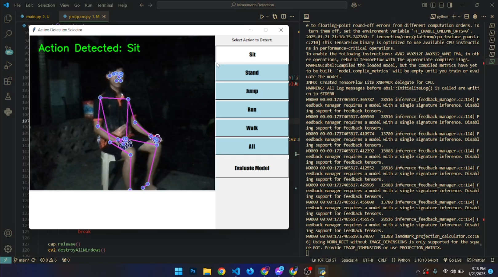
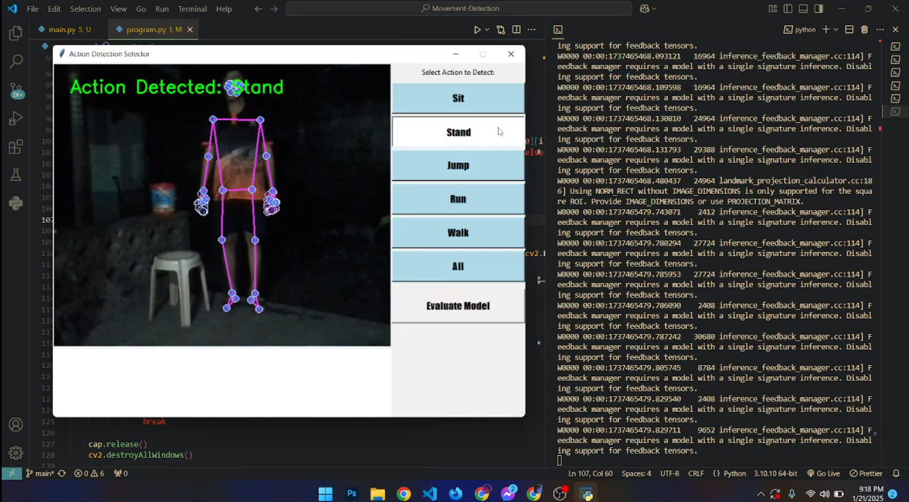
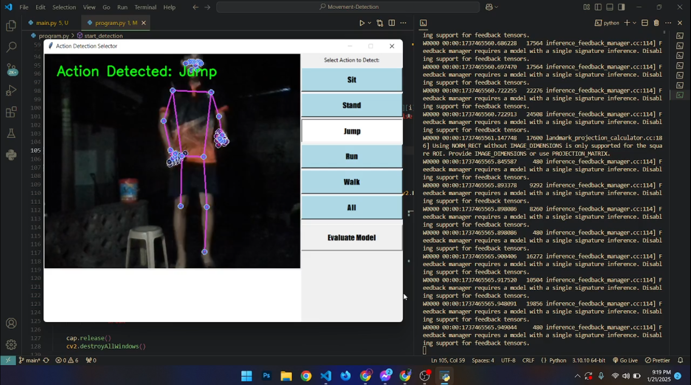
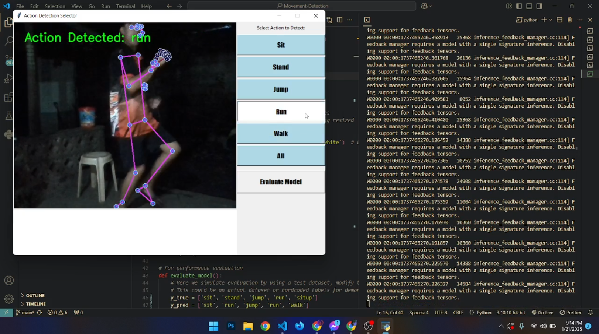
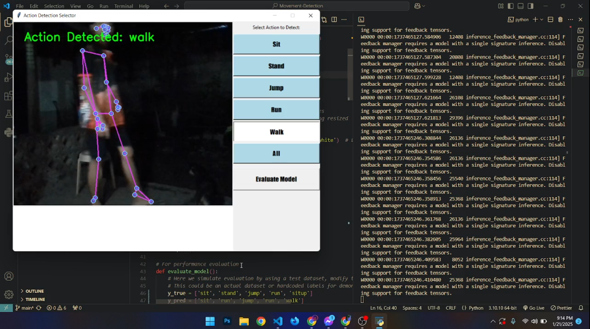

# Movement Capturing and Detection (Running, sitting, Walking, Standing, Jumping)
  This system uses computer vision techniques to capture and analyze human movements in real-time. 
  It leverages pose estimation models to detect body landmarks and classify common actions such as running, sitting, walking, standing, and jumping. 
  The integrated approach combines advanced machine learning for action recognition with intuitive visual feedback, enabling dynamic movement tracking 
  for various applications in fitness, rehabilitation, and interactive systems.

## Get started
  -  Run the program.py file to launch the action detection system.
  -  Ensure the camera is positioned to clearly capture your movements when the window feed opens.
  -  Use the buttons on the right panel to select the action you want to detect: Sit, Stand, Walk, Jump, Run, or All Actions.
  -  The selected action will be displayed at the top-left corner of the window feed when detected.

# Samples

 
 
 
 
 
